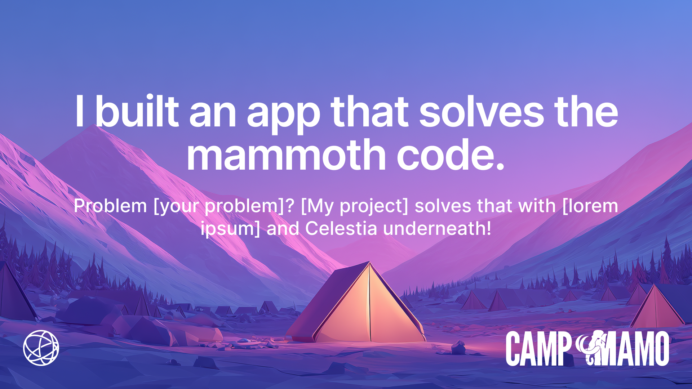

# Camp Mamo Demos Start

Welcome to the **Camp Mamo Demos** repository!  
This repo is the single place where participants in **Camp Mamo**—Celestia's hackathon preparation program—can find, pull, and explore every example project used throughout the course.

---

## 📚 What is this repo?

Camp Mamo spans many topics and hands-on sessions. To keep things organised we host each demo or reference implementation in its **own standalone Git repository**.  
This repo is therefore an **anchor / index**: every top-level folder here points to another repository that holds the actual demo code.

We keep these external repos as **Git submodules** so that you can:

1. fetch everything with a single clone command;
2. stay in sync with upstream fixes and improvements;
3. avoid inflating the size of this meta-repo.

If the term _submodule_ is new to you—don't worry, the commands you need are listed below.

---

## 🚀 Quick start

```bash
# Clone *and* pull all submodules in one go
$ git clone --recurse-submodules git@github.com:celestiaorg/campmamo-demos.git

# If you already cloned without the flag, run:
$ git submodule update --init --recursive
```

Each sub-folder now contains a fully-functional project ready for you to open, build, and hack on.

---

## 📦 Large files (Git LFS)

Some demos (such as `dojo-demo`) track game assets or other binaries using **Git LFS**. If you don't have it installed yet, run:

```bash
# macOS (Homebrew)
brew install git-lfs

# Linux (apt example)
sudo apt-get install git-lfs

# One-time global setup
git lfs install
```

After cloning this repo, Git LFS files will be pulled automatically the first time you access a directory that needs them. You can also fetch everything explicitly with:

```bash
git lfs pull --all
```

---

## 🗂️ Repository layout

```
campmamo-demos/
├── dojo-demo/            # ↳ https://github.com/gbarros/dojo-demo (submodule)
├── chopin-demo/          # placeholder – upcoming demo
├── initia-demo/          # placeholder – upcoming demo
├── livy-demo/            # placeholder – upcoming demo
├── rollkit-demo/         # placeholder – upcoming demo
└── LICENSE               # licence information for this index repo
```

> The exact list will grow as the course progresses. Check back often or run `git pull --recurse-submodules` to stay up-to-date.

---

## 📱 Media Kit and Social Sharing



Building in public is the fastest way to level up.

Share what you're learning. Show what you're building. And when you post, use our Figma templates to make it shine. They’re perfect for progress updates and “Today I Learned” moments.

### How to use the templates:

1. **Access the templates**: Visit our [Figma design file](https://www.figma.com/design/AodtIu10eBxHEKMIXe7UMI/Camp-Mamo-shareables?node-id=0-248&t=p1vBI91rNYWcTWUh-0)

2. **Copy to your workspace**: Click the "Copy" button in the top-right corner of the Figma file to duplicate it to your own Figma workspace

3. **Customize the content**:
   Edit the placeholder text to describe your specific project or learning

4. **Keep the design consistent**: The templates are designed with the Camp Mamo brand in mind - please maintain the existing colors, fonts, and layout for consistency

5. **Export your image**: Select the frame you want to export, then use Figma's export feature to save as PNG or JPG

6. **Share away**: Post your customized template on Twitter, LinkedIn, Discord, or wherever you share your work!

7. **Tag us**: When you post, don't forget to tag us `@Celestia`

---

## 🤝 Contributing & adding new demos

1. Fork this repo and create a new branch.
2. Add the external demo as a submodule:
   ```bash
   git submodule add <demo-repo-git-url> <folder-name>
   ```
3. Commit and push your changes, then open a pull request.  
   Remember to include a short description of the demo and a link to its documentation in the PR body.

Please keep new demos small and focused—participants should be able to clone everything quickly.

---

## 📄 Licence

The content of **this** repo is licensed under the **Apache License 2.0** (see `LICENSE`).  
Each submodule keeps its own licence; make sure you comply with it when re-using code.

---

## 🙋 Need help?

If you hit any issues, open an [issue](https://github.com/celestiaorg/campmamo-demos/issues) or post in the Camp Mamo Discord. We're happy to help!

Happy hacking! 🚀
